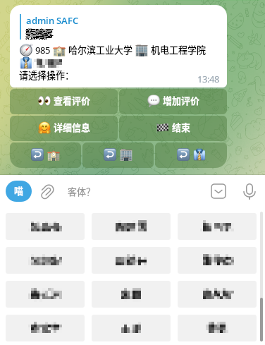

<div align="center">
  <h1>🏛️</h1>
  <!--  -->
  <h1>SAFC - bot</h1>
  <b>🧪 in developing</b><br/>
  <i>社群，保护，开放</i><br/>
  <a href="https://t.me/SAFC_bot"><del>Telegram 机器人</del></a> | <a href="https://t.me/SAFC_bak_bot">备份机器人</a> | <a href="https://t.me/SAFC_group">群组社区</a><br/>
</div>

# 大学生反诈中心 SAFC



## 背景

自从最初的导师评价网（urfire）关闭，时至今日，一批一批的新导师评价数据分享平台的迭起兴衰，最终都落于 404 或收费闭塞。
不知是何等阻力，让受过欺骗的学生和亟需信息的学生散若渺茫星火。
故建此平台与机器人，革新方式，坚持“社群，保护，开放”的理念，信奉密码朋克、开源精神，愿此和谐共赢地持久性发展传承下去。

## 目的

除了警惕那些专业的反诈人员，那些大学生最容易信任的客体才是最危险的。

为了最大保护信息安全与隐私，大学生反诈中心（SAFC）基于 Telegram 平台，包含以下功能

* Telegram 群组社区 [@SAFC_group](https://t.me/SAFC_group) —— 公告与交流平台 *本仓库未来可能会因为各种原因失踪，请加入此群组以防迷路*
* Telegram 机器人 ~~[@SAFC_bot](https://t.me/SAFC_bot)~~ 备份：[@SAFC_bak_bot](https://t.me/SAFC_bak_bot) —— 学校、专业、学院、课程、导师的交叉评价与查询

本平台遵守几点为主旨：

* _出发_：共享，开放，自由的精神；我为人人，人人为我的理念。**永远免费，数据、代码开源**。
* _技术_：密码朋克，尽可能地做好隐私保护、数据与人身安全；数据共享代码开源，相互监督共进。
* _定位_：综合大学生所需要的功能，不光包括最基本的导师评价和查询功能，还能对学校、专业、学院、课程、学生、已有的评价进行评价；另外提供一个交流平台。
* 只有评价，没有评分，每个客体都不能由单独的分数来决定

## 隐私

- 为防止滥用，您的 telegram uid 可能会被临时储存在内存中，最多 1 日，除此之外不会记录任何个人信息。
- 「发布人 OTP」是可以让您日后证明本评价由您发布，由此您可以修改/销毁此评论。其非必选项，且仅会储存其加盐哈希。
- 我们默认 Telegram 是可信及安全的
- 早期开发结束后，代码与数据将完全开源

## 发展

目前敏捷性开发，以功能上线时间为先，后续需要大量的开发重构。*永远的 beta 版*

## 参考

<details>
<summary>初始数据来源：</summary>
https://github.com/pengp25/RateMySupervisor

https://gitee.com/wdwdwd123/RateMySupervisor
</details>

<details>
<summary>参考项目：</summary>
开发参考： 
https://github.com/magnickolas/remindee-bot
</details>


# 开发

## 快速开始

1. Install [Rust].
2. Setup your bot with [@botfather](https://t.me/botfather).
3. Clone this repository.
4. Set the environment variables:
   ```sh
   export TELOXIDE_TOKEN=<BOT TOKEN e.g.  123456789:ABCDEFGHIJKLMNOPQRSTUVWXYZ>
   export TELOXIDE_PROXY=<PROXY e.g. http://127.0.0.1:7890>
   ```
5. Run `cargo run` from the repository directory.
6. Send a message to your bot with `/start` command.
7. Enjoy!

## TODOs

- VIS
  - [ ] logo
- db
  - [ ] 模块重构
  - [ ] 分离与定时备份、发布
- tg bot 功能
  - `/start` 重构 —— 作为功能指引
  - [x] 嵌套评价
    - [ ] 更方便优雅地评价（翻页、回调）
  - [ ] 模糊/快速 搜索 - 转为内联按钮的形式
  - [ ] 词云？关键字提取？
  - [ ] 数据汇报
  - [ ] 抗攻击
  - [ ] 数据定时上传备份
- web
  - [ ] 待定 actix-web? axum?
- 部署
  - [ ] env 转而使用配置文件的形式 & docker
- 数据
  - wiki 形式的客体基本信息
- **带计划！**
  - [ ] 基于 Telegram 通讯的分布式数据库与分布式 bot

---

[框架科工](https://craft.framist.top/) | 致力为虚无的世间献上一点花火🔥
