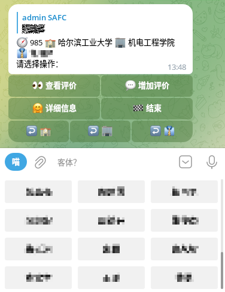

# 使用指南

使用 [Web 端](doc/usage.md#web-端列表) 可以初步的查询信息

更多功能请使用 [Telegram 机器人](usage.md/#telegram-bot-列表)增加导师、增加评价、查看与增加嵌套评价。

Telegram 机器人使用演示 demo

 

加入 Telegram 群组社区 [@SAFC_group](https://t.me/SAFC_group) 以防迷路

关于如何评价导师：[导师评价指南](./community.md#导师评价建议)

## Web 端列表

- [vercel](https://safc-web.vercel.app/)
- [github.io (旧版网页端)](https://framist.github.io/safc)

## Telegram bot 列表

- [@SAFC_bak_bot](https://t.me/SAFC_bak_bot)
- ~~[@SAFC_bot](https://t.me/SAFC_bot)~~

